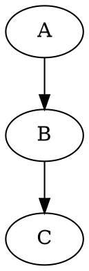

# ddd

+ dddd
+ dddd

```dot
digraph G{
A->B
B->C}
```

==marked==
*[HTML]: Hyper Text Markup Language
*[W3C]: World Wide Web Consortium
The HTML specification
is maintained by the W3C.

## 第二部
ddddd
dddd
